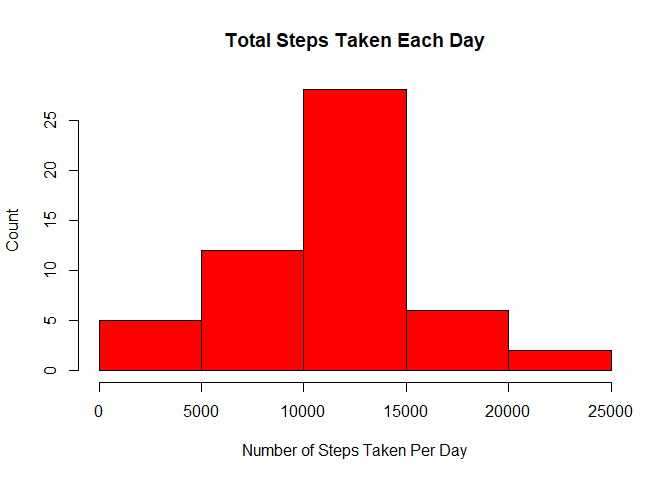
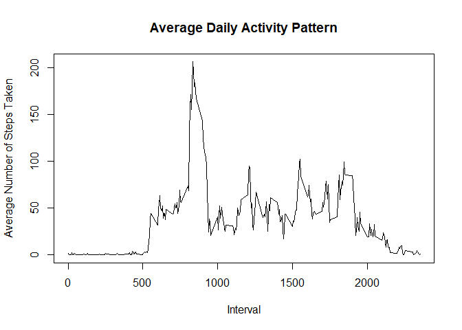
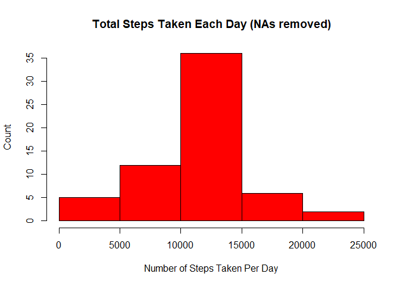

# Week2_Peer_Graded_Assignment.Rmd
Yvonne Glanville  


This code reads in the data to a data frame called activity.

```r
activity <- read.csv("activity.csv", header = TRUE, sep = ",")
```

This code changes date from a factor to a date and verifies the format.

```r
activity$date <-as.Date(activity$date, format="%Y-%m-%d")
str(activity)
```

```
## 'data.frame':	17568 obs. of  3 variables:
##  $ steps   : int  NA NA NA NA NA NA NA NA NA NA ...
##  $ date    : Date, format: "2012-10-01" "2012-10-01" ...
##  $ interval: int  0 5 10 15 20 25 30 35 40 45 ...
```

Code calculates the mean number of steps taken per day, creates a histograms of the steps taken per day, and calculates the mean and median of the total steps taken per day.

```r
TotalStepsPerDay <- setNames(aggregate(activity$steps, by = list(Date=activity$date), FUN=sum), c("Date", "TotalSteps"))
hist(TotalStepsPerDay$TotalSteps, xlab = "Number of Steps Taken Per Day", ylab = "Count", main = "Total Steps Taken Each Day", col=2)
```

<!-- -->

```r
MeanStepsPerDay <- mean(TotalStepsPerDay$TotalSteps, na.rm=TRUE)
MedianStepsPerDay <- median(TotalStepsPerDay$TotalSteps, na.rm=TRUE)
options(scipen=10)
```
The mean number of total steps per day is 10766.1886792 and the median number of total steps is 10765.


Time series plot of the average daily steps with respect to 5 minute time interval.

```r
AverageStepsPerInterval <- setNames(aggregate(activity$steps, by = list(Interval = activity$interval), FUN=mean, na.rm=TRUE), c("Interval", "AverageSteps"))
plot(AverageStepsPerInterval$Interval, AverageStepsPerInterval$AverageSteps, type="l", xlab="Interval", ylab="Average Number of Steps Taken", main="Average Daily Activity Pattern")
```

<!-- -->

```r
MaxAverageSteps_In_Interval <- AverageStepsPerInterval$Interval[which.max(AverageStepsPerInterval$AverageSteps)]
```
The interval with the highest average number is steps is 835.


Creating a histogram and calculating the mean and median of total daily steps after filling in the missing values in data frame with the mean for each 5 minute interval.

```r
library(doBy)
```

```
## Warning: package 'doBy' was built under R version 3.3.3
```

```r
NaInData <- sum(is.na(activity[,]))
myFunction <- function(x,...){
        c(Mean = mean(x,...))
}
MeanForEachInterval <- summaryBy(steps ~ interval, data = activity, FUN = myFunction, na.rm=TRUE)
freshSet <- activity
for (i in 1:length(freshSet$steps)){
        if (is.na(freshSet$steps[i])){
                valueofmean <- MeanForEachInterval$steps.Mean[match(freshSet$interval[i], MeanForEachInterval$interval)] 
                freshSet$steps[i] <- valueofmean
        }
        
}
TotalSteps <- setNames(aggregate(freshSet$steps, by = list(Date=freshSet$date), FUN=sum), c("Date", "TotalSteps"))
hist(TotalSteps$TotalSteps, xlab = "Number of Steps Taken Per Day", ylab = "Count", main = "Total Steps Taken Each Day (NAs removed)", col=2)
```

<!-- -->

```r
MeanSteps <- mean(TotalSteps$TotalSteps, na.rm=TRUE)
MedianSteps <- median(TotalSteps$TotalSteps, na.rm=TRUE)
```

The number of missing values in the data set is 2304.  
The mean number of total steps per day is 10766.1886792 and the median number of total steps is 10766.1886792. Removing the NAs and replacing them with the mean steps for each interval left the mean unchanged with respect to the calculation ignoring NAs, but the calculation did change the median.  The median calulated after recodng the data in this manner makes it equal to the mean. 


Code to see patterns in activity based on weekdays and weekends.

```r
library(lattice)
weekdays1 <- c('Monday', 'Tuesday', 'Wednesday', 'Thursday', 'Friday')
freshSet$Day <- factor((weekdays(freshSet$date) %in% weekdays1), levels=c(FALSE, TRUE), labels=c('weekend','weekday'))
myFunction <- function(x,...){
        c(Mean = mean(x,...))
}
MeanWeekdaysends <- summaryBy(steps ~ interval+Day, data =freshSet, FUN = myFunction)
xyplot(steps.Mean ~ interval|Day,MeanWeekdaysends, type="l", xlab="Interval", ylab="Number of Steps", layout=c(1,2))
```

<!-- -->
